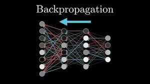

#   
# Backpropagator 🧬

**Backpropagator** project is a project made by me and my friend for understanding how backpropagation works by building a computational graph and automating the chain rule from the ground up.


## 📖 About
In this project, my friend and I implemented **Backpropagation** using only Python and the `math` library. While modern frameworks like PyTorch handle massive tensors on GPUs, **Backpropagator** works at the scalar level, making it the perfect educational tool to understand exactly how gradients flow through a neural network.

## ✨ Key Features
* **Scalar-Level Autograd**: A custom `Value` class that stores data and its derivative (gradient).
* **Automated Chain Rule**: Uses a topological sort to ensure gradients are propagated in the correct order.
* **Full Neural Stack**: Includes building blocks for `Neuron`, `Layer`, and `MLP` (Multi-Layer Perceptron) architectures.
* **Mathematical Operations**: Supports `+`, `-`, `*`, `/`, `**`, and activation functions like `tanh` and `exp`.
* **PyTorch Verified**: Includes benchmarks to verify our gradient calculations against industry-standard results.


## 🛠️ Implementation Details

### The `Value` Object
The core of the engine. It overloads Python operators to build the graph dynamically during the forward pass.

```python
x1 = Value(2.0, label='x1')
w1 = Value(-3.0, label='w1')
b = Value(6.88, label='b')

# Forward pass (building the graph)
o = (x1 * w1 + b).tanh()

# Backward pass (calculating gradients)
o.backward()